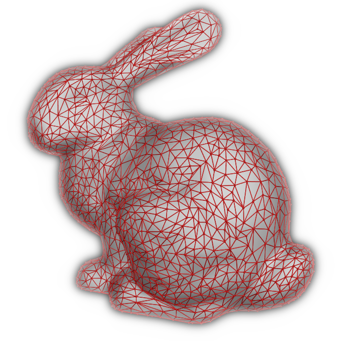

# Alum: A Halfedge based Polygon Mesh Library

[](https://github.com/ranjeethmahankali/alum/actions/workflows/ci.yml)
[](https://docs.rs/alum/latest/alum/)
[](https://crates.io/crates/alum)
[](https://github.com/ranjeethmahankali/alum/tree/examples/examples)



This library is inspired by
[OpenMesh](https://www.graphics.rwth-aachen.de/software/openmesh/), hence has an
API very similar to that of OpenMesh. I love using OpenMesh in C++, and wrote
this library because I couldn't find an equivalent in Rust. Huge thanks to
OpenMesh and it's maintainers for the inspiration!

For now, the features of this library exist to serve my other projects. It has
near parity with the `OpenMesh/Core` module, and new features will be added as
required by my other projects.

## Installation

This can be added to a Rust project as a dependency from
[crates.io](https://crates.io/crates/alum) with:

```sh
cargo add alum
```

Or by adding the following to your `Cargo.toml`:

```toml
[dependencies]
alum = "0.4.1"
```

## Usage and Features

This library uses [`glam`](https://github.com/bitshifter/glam-rs) out of the box
for geometric types such as points, normals etc. These are enabled by the
`use_glam` feature and can be disabled if you don't want to use `glam`.

You can use this library with your own geometric types for points and normals
etc. by implementing an adaptor that tells this library how to work with your
geometric types. Read the [documentation](https://docs.rs/alum/latest/alum/) to
learn more about this.

This library also comes with a property system just like the one in `OpenMesh`,
with some small improvements and differences. The properties are always
synchronized with the mesh elements, through additions, deletions and garbage
collections which result in reordering of elements. Unlike properties in
`OpenMesh`, the properties here use interior mutability with `RefCell<T>` and
enforce runtime borrow checking rules. Read the
[documentation](https://docs.rs/alum/latest/alum/) to learn more.
